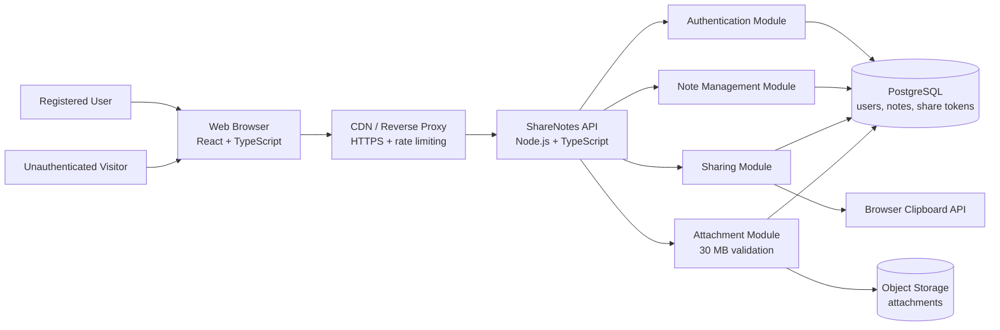
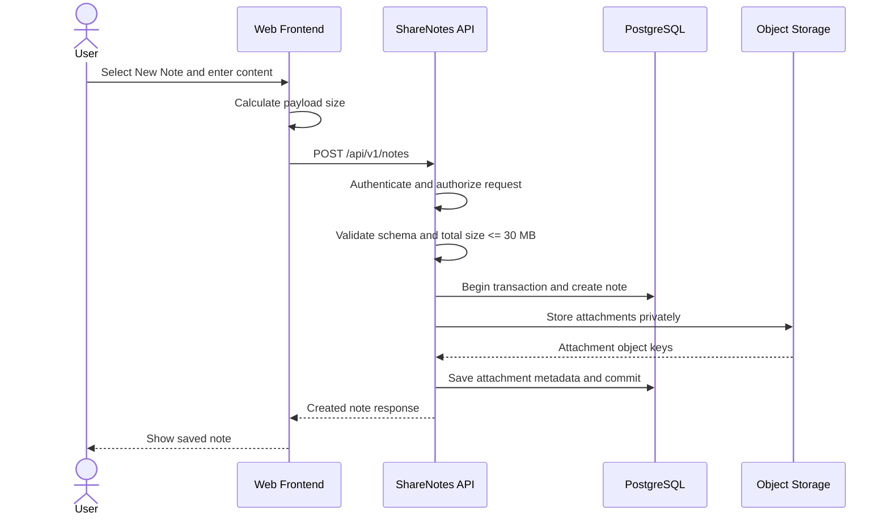
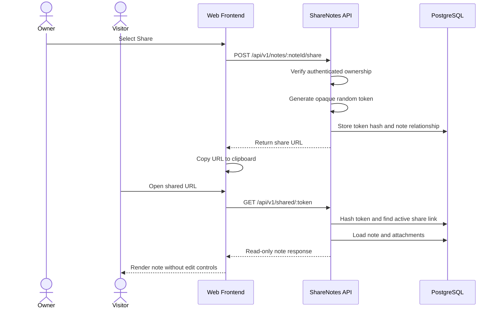
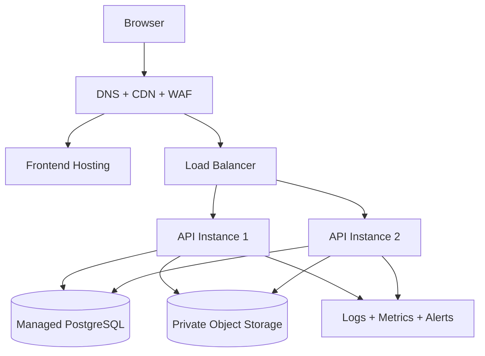

# ShareNotes High-Level System Architecture

**Source requirements:** [reuirement.md](reuirement.md)

**JIRA ID:** SN-101

**Date:** September 9, 2026

## 1. Architecture Recommendation

ShareNotes should use a modular three-tier web architecture:

1. A browser-based frontend for authenticated note management and read-only shared-note viewing.
2. A stateless backend API responsible for authentication, authorization, note lifecycle operations, sharing, validation, and attachment coordination.
3. Managed persistence services consisting of a relational database for users and note metadata, and object storage for attachments.

The backend should be deployed as a modular monolith initially. This keeps the system straightforward to develop and operate while providing clear module boundaries for future scaling. Stateless API instances can scale horizontally behind a reverse proxy or load balancer.

## 2. Component Diagram



## 3. Key Components and Responsibilities

### 3.1 Web Frontend

**Recommended technology:** React with TypeScript, using a framework such as Next.js or Vite-based React.

Responsibilities:

- Display the authenticated user's note list and note editor.
- Provide the **New Note**, **Save**, **Share**, and **Delete** workflows.
- Provide a rich-text editing experience using a maintained editor library such as Tiptap or Lexical.
- Display client-side validation errors, including the 30 MB size limit.
- Send authenticated API requests using secure session cookies.
- Render shared notes in read-only mode without exposing editing controls.
- Copy generated share links using the browser Clipboard API.
- Handle loading, save failure, authorization failure, and deleted-note states.

Client-side validation is a usability feature only. The backend remains the authoritative enforcement point for size and authorization rules.

### 3.2 CDN / Reverse Proxy

**Recommended technology:** Cloudflare, AWS CloudFront with an application load balancer, or an equivalent managed edge service.

Responsibilities:

- Terminate HTTPS and redirect HTTP to HTTPS.
- Route browser requests to the frontend and API.
- Apply basic rate limiting and request filtering.
- Cache safe static frontend assets.
- Prevent direct exposure of internal application services.

Shared note content should not be broadly cached unless cache invalidation is designed carefully. Deleted or updated notes must not remain available through stale public caches.

### 3.3 Backend API

**Recommended technology:** Node.js with TypeScript and NestJS or Fastify.

Responsibilities:

- Expose versioned REST endpoints for authentication and note operations.
- Validate request schemas and payload sizes.
- Authenticate users and authorize owner-only mutations.
- Coordinate database transactions and attachment storage operations.
- Return consistent errors, including `401 Unauthorized`, `403 Forbidden`, `404 Not Found`, and `413 Payload Too Large`.
- Produce structured logs, health checks, and audit events.

The API should be stateless so multiple instances can serve requests safely.

### 3.4 Authentication Module

Responsibilities:

- Register and authenticate users.
- Create, validate, rotate, and revoke sessions.
- Attach the authenticated user identity to API requests.
- Store passwords only as strong one-way hashes when local credentials are supported.
- Set session cookies with `HttpOnly`, `Secure`, and appropriate `SameSite` settings.

**Recommended approach:** Use an established identity provider such as Auth0, AWS Cognito, or a well-maintained application authentication library. Avoid implementing cryptographic authentication primitives from scratch.

### 3.5 Note Management Module

Responsibilities:

- Create notes owned by the authenticated user.
- Retrieve the owner's note list and individual notes.
- Update note content and metadata after verifying ownership.
- Permanently delete note metadata and associated attachments.
- Maintain `created_at`, `updated_at`, and deletion consistency.

All create, update, and delete operations must require an authenticated owner. A note identifier must not be treated as proof of ownership.

### 3.6 Sharing Module

Responsibilities:

- Generate a cryptographically random, high-entropy share token for a note.
- Store only a hash of the token where practical; return the raw token only when creating the share URL.
- Resolve a share token to a read-only note response.
- Ensure shared reads do not require authentication.
- Revoke or invalidate the token when the note is deleted.
- Avoid exposing internal database IDs in public URLs.

A public URL should use an opaque token, for example:

```text
https://sharenotes.com/shared/<opaque-token>
```

The share token grants read access only. It must never grant edit or delete access.

### 3.7 Attachment Module

Responsibilities:

- Validate the aggregate note payload, including text and attachments, against the 30 MB maximum.
- Validate individual file type, content type, and filename rules.
- Upload attachments to private object storage.
- Associate attachment records with the owning note.
- Remove attachment objects when a note is permanently deleted.
- Issue short-lived signed download URLs when attachments must be displayed.

For large attachments, the API can issue a short-lived upload session and let the browser upload directly to object storage. The API must still enforce the aggregate 30 MB limit before finalizing the note.

### 3.8 PostgreSQL Database

Responsibilities:

- Store users and authentication references.
- Store note metadata and content or a durable content reference.
- Store share-token hashes and their note relationships.
- Store attachment metadata and object-storage keys.
- Enforce foreign keys, ownership relationships, and transaction boundaries.

Suggested logical entities:

- `users`: user identity and timestamps.
- `notes`: owner, title, rich-text content, size, timestamps, and status.
- `share_links`: note relationship, token hash, creation time, and optional revocation time.
- `attachments`: note relationship, object key, size, media type, and timestamps.

Indexes should include `notes.owner_id`, `share_links.token_hash`, and attachment foreign keys.

### 3.9 Object Storage

**Recommended technology:** Amazon S3, Azure Blob Storage, or Google Cloud Storage.

Responsibilities:

- Store attachment binaries outside the relational database.
- Keep buckets private by default.
- Encrypt data at rest.
- Support lifecycle cleanup for abandoned uploads.
- Provide access through short-lived signed URLs rather than public bucket permissions.

### 3.10 Observability and Operations

Responsibilities:

- Centralize structured application logs.
- Track API latency, error rates, upload rejections, and storage failures.
- Monitor database and object-storage health.
- Alert on repeated authorization failures, unusual share-link access, and capacity thresholds.
- Provide backups and tested restore procedures for PostgreSQL and attachment storage.

Recommended tools include OpenTelemetry with a managed logs and metrics platform, plus Sentry or an equivalent error-monitoring service.

## 4. Suggested API Surface

| Method | Endpoint | Auth | Purpose |
| --- | --- | --- | --- |
| `POST` | `/api/v1/notes` | Required | Create a note after validation |
| `GET` | `/api/v1/notes` | Required | List the authenticated user's notes |
| `GET` | `/api/v1/notes/:noteId` | Owner | Retrieve an editable note |
| `PATCH` | `/api/v1/notes/:noteId` | Owner | Update note content or attachments |
| `DELETE` | `/api/v1/notes/:noteId` | Owner | Permanently delete a note and its share links |
| `POST` | `/api/v1/notes/:noteId/share` | Owner | Create or retrieve a share link |
| `GET` | `/api/v1/shared/:token` | Public | Retrieve a read-only shared note |

The API should use request schemas, consistent JSON error responses, and optimistic concurrency protection such as an `updated_at` check or version number to avoid silently overwriting a newer edit.

## 5. Core Data Flows

### 5.1 Create and Save a Note



If validation fails, the API returns `413 Payload Too Large` for the size limit or `400 Bad Request` for invalid content. The database transaction must not leave a partially created note.

### 5.2 Generate and Open a Shared Link



### 5.3 Edit a Note

1. The frontend sends a `PATCH` request with the authenticated session.
2. The API verifies that the session user owns the note.
3. The API validates the complete resulting payload and the 30 MB limit.
4. The API updates the note and attachment metadata in a transaction.
5. Subsequent owner and shared-link reads return the new content.

### 5.4 Delete a Note

1. The frontend asks the owner to confirm deletion.
2. The API verifies ownership and starts a deletion transaction.
3. The API deletes the note, share links, and attachment metadata.
4. The system removes associated attachment objects, using a retryable cleanup job if needed.
5. Future requests using the share token return `404 Not Found` or a deleted-note response.

## 6. Security and Reliability Decisions

- Enforce authorization on every note mutation in the backend.
- Use TLS for all traffic and secure, HTTP-only sessions.
- Use cryptographically secure random share tokens with sufficient entropy.
- Keep attachment storage private and use short-lived signed URLs.
- Validate both declared and detected attachment content types where possible.
- Apply rate limits to authentication, note creation, share-link generation, and public shared reads.
- Use parameterized queries or an ORM to prevent SQL injection.
- Sanitize rich-text output on write or render to prevent stored cross-site scripting.
- Configure restrictive Content Security Policy and other security headers.
- Use database backups, object-storage versioning where appropriate, and deletion monitoring.
- Prevent stale CDN responses from exposing deleted or outdated shared notes.

## 7. Technology Choices

| Area | Recommendation | Reason |
| --- | --- | --- |
| Frontend | React + TypeScript | Strong ecosystem for editor and responsive application workflows |
| Rich-text editor | Tiptap or Lexical | Structured document model and extensibility |
| Backend | Node.js + TypeScript with NestJS or Fastify | Shared language, validation support, and scalable stateless APIs |
| API style | Versioned REST | Simple browser integration and clear authorization boundaries |
| Database | PostgreSQL | Transactions, relational ownership, indexing, and reliable constraints |
| Attachments | S3-compatible object storage | Durable binary storage and signed URL support |
| Authentication | Managed identity provider or established auth library | Reduces authentication implementation risk |
| Edge | CDN/reverse proxy with WAF and rate limiting | HTTPS, routing, caching control, and abuse resistance |
| Deployment | Managed container platform or serverless containers | Horizontal scaling without managing individual servers |
| Observability | OpenTelemetry plus managed logs, metrics, and error tracking | Traceability across API, database, and storage operations |

These choices are recommendations, not hard dependencies. The important architectural properties are clear module boundaries, transactional metadata storage, private attachment storage, backend-enforced limits, and owner-only mutation authorization.

## 8. Deployment View



## 9. Architecture Decisions and Open Questions

### Decisions

- Start with a modular monolith rather than microservices.
- Keep the API stateless for horizontal scaling.
- Use PostgreSQL for note ownership, metadata, and share-link records.
- Store attachment binaries in private object storage.
- Treat the 30 MB limit as an aggregate backend-enforced limit.
- Use opaque public share tokens that provide read-only access only.

### Open Questions for Detailed Design

- Will rich-text content be stored as structured JSON, sanitized HTML, or both?
- Are share links permanent, revocable, or optionally expiring?
- Are multiple attachments supported per note, and what file types are allowed?
- Is real-time multi-user editing required, or is immediate consistency after save sufficient?
- Which identity provider and cloud hosting platform will be used?
- Should deleted notes be hard-deleted immediately, or retained in a restricted audit store for a defined period?

## 10. Design Review Updates

The following decisions supersede the earlier open questions for the v1 implementation. They were adopted during the senior architecture review documented in [design-review.md](design-review.md).

### 10.1 Consistency and Deletion

- Each note has an integer `version` that increments on every successful update.
- `PATCH /api/v1/notes/:noteId` must include the version the client edited. A stale version returns `409 Conflict` with the current version and a safe-to-display conflict code; the client must reload or present a merge choice.
- Deletion sets `deleted_at` immediately. Deleted notes are excluded from owner lists and return `404 Not Found` through owner detail, shared-read, and attachment endpoints.
- A scheduled retention job permanently removes soft-deleted note records and attachment objects after 60 days. The job is retryable and monitored.
- Real-time collaborative editing is out of scope for v1. Optimistic locking prevents silent overwrites for concurrent saves.

### 10.2 Sharing and Cache Behavior

- Share links are permanent by default but independently revocable by the owner.
- Add `DELETE /api/v1/notes/:noteId/share/:token` for owner-only revocation. The `share_links` table contains nullable `revoked_at`; revoked or deleted links return `404 Not Found`.
- Shared-note responses use `Cache-Control: no-cache, must-revalidate` and an ETag. The client or CDN must revalidate before displaying a cached response, so updates and deletions are not served as unvalidated stale content.
- Authenticated responses use `Cache-Control: no-cache, private`. Static versioned assets may use a long immutable cache lifetime.

### 10.3 Upload and Content Security

- v1 uploads go through the API so the backend can enforce the aggregate 30 MB limit before committing the note. Direct presigned uploads are deferred until their aggregate-size, finalization, and cleanup design is approved.
- The v1 attachment allowlist is PDF, TXT, MD, JPG, PNG, GIF, and WebP. The service checks filename extension, declared content type, and detected magic bytes; executable, archive, and installer formats are rejected.
- Rich text is stored in the selected editor document format and sanitized at API output and frontend rendering with an explicit allowlist. Script, iframe, style, event-handler, and unsafe URL content is rejected or removed.
- Attachment download URLs are private, signed, and short-lived. A shared visitor may request them only through the share-read authorization path and is rate limited per share token.

### 10.4 Attachment Cleanup and Auditability

- Note deletion records attachment cleanup work and sends it to a retryable queue. Object deletion has a one-hour target, dead-letter handling, and an alert when orphaned-object counts exceed the agreed threshold.
- Failed cleanup is retried without restoring public access to the deleted note. A quarantine or manual recovery path is required before production launch.
- Audit events cover note creation, update, deletion, share creation, share revocation, failed authentication, and relevant attachment access. Audit records are access-controlled and retained according to the operational retention policy.

### 10.5 Sessions, Abuse Controls, and API Contracts

- Use a one-hour authenticated session or access token with an optional 30-day refresh session. Refresh tokens rotate, logout invalidates the server-side session, and state-changing requests use SameSite cookies plus CSRF protection.
- Rate limits are enforced per IP for authentication and per user or share token for authenticated and public operations. Exceeded limits return `429 Too Many Requests` with `Retry-After`.
- API errors use a stable JSON envelope with a machine-readable code, safe message, details, timestamp, and trace ID. Production responses never expose stack traces.
- `GET /api/v1/notes` returns metadata only and is paginated with a default limit of 20, a maximum of 100, and deterministic updated-time sorting. Full content is fetched by note ID.

### 10.6 Delivery and Verification

- API releases use blue-green deployment. Database migrations remain compatible with the current and previous API version and are tested before traffic is switched.
- The API contract is published as OpenAPI. CI must cover authorization, 30 MB boundary conditions, invalid file types, XSS payloads, version conflicts, share revocation, deletion `404` behavior, and attachment cleanup retries.
- Production readiness requires tested backups and restore, structured audit logs, health checks, actionable alert thresholds, and a rollback exercise with a target under 10 minutes.
